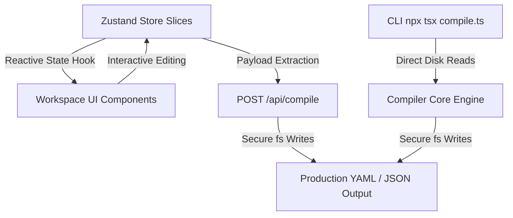

# Architectural Specification: KYFR Platform

This document describes the high-level system architecture, codebase layout, data flows, core execution models, and compiler pipeline mechanics for the **KYFR Platform**.

---

## 1. System Overview

The **KYFR Platform** is a behavioral orchestration control panel designed to configure, validate, simulate, and compile adaptive behavioral parameters for the **Adaptive Orchestration Engine (AOE)**. It allows product, marketing, and governance teams to define:
- **Linguistic and Behavioral Primitives** (e.g., clarity, coaching behavior, directness, risk disclosure).
- **Dynamic Segment Overlays** (demographic, regional, or context-driven behavioral overrides).
- **Situational Governance Safety Shields** (strict caps, floors, and forbidden behavior blocks).
- **Product Journeys and Interaction Strategies** (structured narrative flows, capability maps, and tool-artifact bindings).

These declarations are dynamically resolved at runtime per-user, and statically compiled into production-ready YAML schemas for ingestion by the downstream LLM-orchestration layer.

---

## 2. Directory Structure

```
kyfr-platform/
├── docs/                       # Authoritative Technical Specifications
│   ├── ARCHITECTURE.md         # Top-level System Architecture (this file)
│   ├── PRIMITIVES.md           # Spec: Behavioral & Safety Primitives
│   ├── STORE.md                # Slice API Reference (Zustand States)
│   └── COMPILER.md             # Compiler Blueprint (YAML schemas & routes)
├── src/
│   ├── app/                    # Next.js App Router API and page routes
│   │   ├── api/
│   │   │   ├── compile/        # /api/compile compilation endpoint
│   │   │   ├── generate/       # Synthetic generation helpers
│   │   │   └── publish/        # Registry synchronization
│   │   └── page.tsx            # Main Control Panel UI Entry
│   ├── components/             # Reusable UI Blocks & Workspace Panels
│   │   ├── layout/             # Sidebar, Header, Workspace Area
│   │   └── workspaces/         # Domain Workspaces (Registry, Defaults, Governance, Simulator, etc.)
│   ├── constants/              # Predefined assets & unified registries
│   │   └── primitiveRegistry.ts# Canonical base list of 25+ primitives
│   ├── data/                   # Initial mock schemas & static seed datasets
│   ├── lib/                    # Standard utilities (e.g. recursive toYAML)
│   └── store/                  # Central State Management (Zustand)
│       ├── slices/             # Composed modular state slices
│       ├── helpers/            # Pure function calculations (e.g. resolveCascade)
│       ├── types.ts            # Absolute Type Contracts & System Schemas
│       └── useBehaviorStore.ts # Global behavior hook for UI components
├── runtime/                    # Statically Compiled Target YAMLs
├── schemas/                    # System Validation Drafts
├── manifests/                  # Compile-Ready Deployment Manifests
├── build/                      # Post-Resolution Cache Matrices
└── vitest.config.ts            # Unit Test Environment Configurations
```

---

## 3. Data Flow Architecture



The system operates on an event-driven data flow across three distinct layers:

### A. Reactive State Management (Zustand Store Slices)
1. User adjustments in UI workspaces (e.g., updating a primitive's `base` value, adding a segment overlay modifier, toggling a governance prohibition) trigger actions inside dedicated Zustand slices (`primitivesSlice`, `segmentsSlice`, `governanceSlice`).
2. Slices perform shallow merges, append state transitions into the `auditLogs` queue, and propagate updates to subscribing components.

### B. Workspace Interactivity & Real-Time Simulation
1. Workspaces read compiled values from the store selector hook (`useBehaviorStore`).
2. The **Simulator Workspace** consumes segment rules, mock user traits, and active governance bounds. It evaluates these values instantly using the pure-functional cascade resolver (`resolveCascade.ts`) and presents a visual tracing path.

### C. The Static & Dynamic Compiler Pipeline
- **Dynamic API Path (`/api/compile`)**: The client issues a `POST` request with the complete JSON state containing registries, segments, and shields. The route validates payloads, compiles deterministic schemas, writes compiled configurations to disk (`/runtime`, `/schemas`, `/manifests`), and returns standard pipeline logs.
- **Static CLI Path (`npm run compile-behavior`)**: Developers trigger `tsx src/compiler/compile.ts` to read default static registries directly from disk, execute identical compilation steps, and write output files.

---

## 4. The Resolution Cascade Pipeline

To determine the final value of a behavioral primitive at runtime, the platform executes a deterministic, multi-level **Resolution Cascade** in `src/store/helpers/resolveCascade.ts`:

```mermaid
graph TD
    A[1. Base Baseline Value] -->|Add Segment Modifiers| B[2. Overlay Accumulation]
    B -->|Evaluate Rules & Modifier Values| C[3. Value Clamping [0.0, 1.0]]
    C -->|Enforce Governance Limits| D[4. Governance Safety Adjustments]
    D -->|Clamp Final Value| E[5. Deterministic Final Value]
```

### Cascade Execution Steps:

1. **Baseline Step**:
   - The cascade starts by pulling the primitive's hard-coded baseline value (`prim.base`, typically in the range `[0, 1]`).
   - A `base` trace step is logged into `CascadeStep[]` with `delta: 0` and `runningValue = base`.

2. **Overlay Accumulation (Segment Modifiers)**:
   - The engine iterates through all **Active Segments** associated with the selected user context.
   - For each matching segment, the engine verifies user properties against the segment's rules list. If matching, the segment's corresponding modifier value (e.g., `+0.15` or `-0.10`) is added.
   - Each matching segment modifier appends an `overlay` trace step containing its `sourceName`, `delta`, and updated `runningValue`.

3. **Intermediate Value Clamping**:
   - After accumulated overlays are resolved, the intermediate value is mathematically clamped to `[0.0, 1.0]` to guarantee semantic consistency.

4. **Governance Safety Enforcement**:
   - The engine parses **Safety Shields** to check for matching conditions on the targeted primitive.
   - If a shield condition matches (e.g., `always` or `anxietyLevel == high`), its threshold limits are checked:
     - **Cap Constraints**: If the resolved value exceeds `thresholdValue`, the value is restricted to `thresholdValue`. A `governance` step is logged with a negative delta.
     - **Floor Constraints**: If the resolved value falls below `thresholdValue`, it is adjusted up to `thresholdValue`. A `governance` step is logged with a positive delta.

5. **Clamping & Yield**:
   - The final resolved value is clamped again to `[0.0, 1.0]` and returned as `finalValue` along with the complete step-by-step evaluation log `steps`.

---

## 5. Compilation Pipelines

The compilation layer offers two alternative execution paths sharing the unified `toYAML` utility:

### 1. Static CLI Pipeline (`src/compiler/compile.ts`)
- **Execution**: Run manually or inside CI/CD using `npm run compile-behavior`.
- **Methodology**: Imports canonical configurations directly from `src/constants/primitiveRegistry.ts` and standard templates, formats them into schemas, writes them to disk synchronously using Node `fs`.
- **Purpose**: Establishes production builds during continuous integration, ensuring runtime configurations are saved in version control.

### 2. Dynamic API Endpoint (`src/app/api/compile/route.ts`)
- **Execution**: Triggered via AJAX `POST` requests from the control panel UI.
- **Methodology**: Receives live, client-side store state in the request body. Writes state records directly into targeted environment configurations in real-time.
- **Purpose**: Enables immediate, code-free configuration testing directly within developer workspaces.
